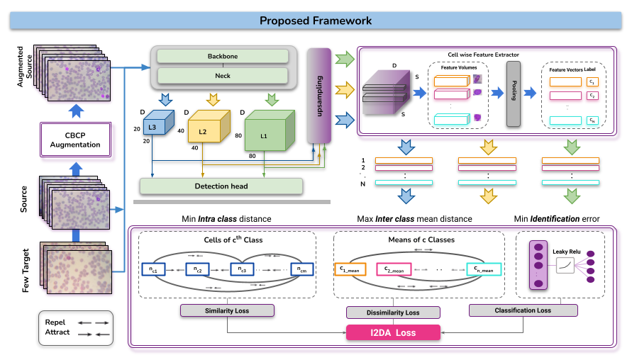
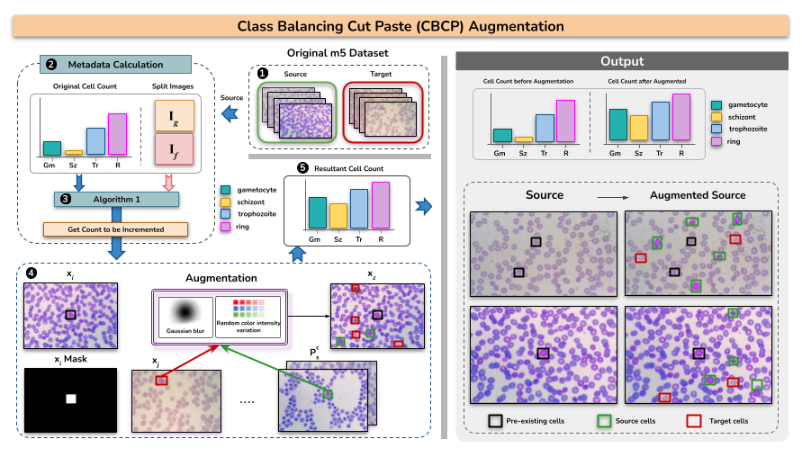
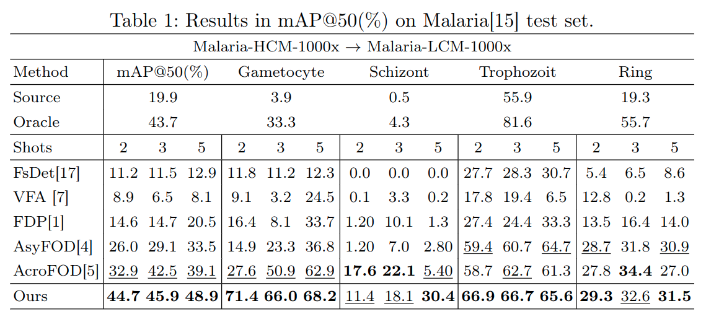
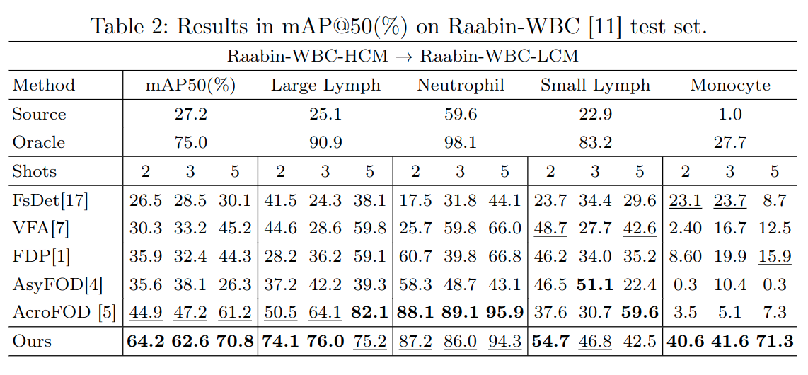
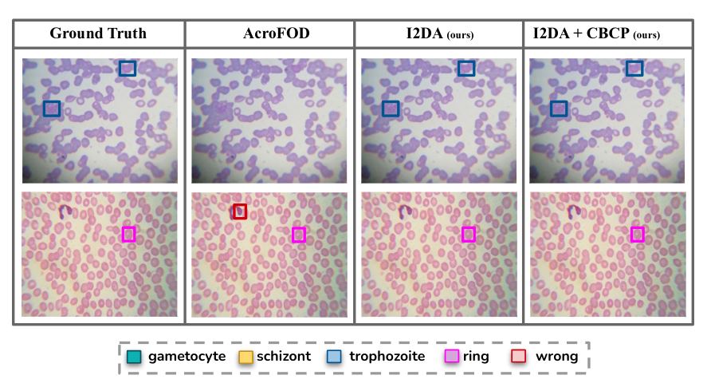

# Few-Shot Domain Adaptive Object Detection for Microscopic Imagest - MICCAI-2024
<p align="center">
    
</p>

#### [Sumayya Inayat](https://www.linkedin.com/in/sumayya-inayat/)<sup>1</sup>, [Nimra Dilawar](https://www.linkedin.com/in/nimradilawar/)<sup>1</sup>, [Waqas Sultani](https://www.linkedin.com/in/waqas-sultani-ph-d-3549bb60/)<sup>1</sup> and [Mohsen Ali](https://mohsenali.github.io/)<sup>1</sup>

#### **<sup>1</sup>Information Technology University (ITU) Lahore, Pakistan**

[](https://arxiv.org/abs/2407.07633)
[](https://im.itu.edu.pk/few-shot-daodmi/)

[comment]: [](https://mbzuaiac-my.sharepoint.com/:f:/g/personal/muhammad_sohail_mbzuai_ac_ae/Ei-vfphu1RVOs0Zkle8vSD8Bub6XxaPxBnwEY2j5uWCVbQ?e=cjbFIU)

## Framewrok

<p align="center">
  
</p>

## Motivation
Few-shot domain adaptive object detection (FSDAOD) addresses the challenge of adapting object detectors to target domains with limited labeled data. We propose a novel FSDAOD strategy for microscopic imaging. Our contributions include: 1) a domain adaptive class balancing strategy for few shot scenarios; 2) multi-layer instance-level inter and intra-domain alignment by enhancing similarity between the instances of classes regardless of the domain and enhancing dissimilarity when it’s not. Furthermore, an instance-level classification loss is applied in the middle layers of the object detector to enforce the retention of features necessary for the correct classification regardless of the domain. Extensive experimental results with competitive baselines indicate the effectiveness of our proposed framework by achieving state-of-the-art results on two public microscopic datasets.

### Installation
Coming Soon

### Datasets
Coming Soon

### Training
Coming Soon

### Evaluation
Coming Soon

## 👁️💬 Augmentation
<p align="center">
  
</p>

## 🔍 Quantitative Results
<p align="center">
  
</p>
<p align="center">
  
</p>


## 📊 Qualitative Results
<p align="center">
  
</p>


## 📜 Citation
```bibtex
@article{inayat2024few,
    title={Few-Shot Domain Adaptive Object Detection for Microscopic Images},
    author={Inayat, Sumayya and Dilawar, Nimra and Sultani, Waqas and Ali, Mohsen},
    journal={arXiv preprint arXiv:2407.07633},
    year={2024}
}
```
